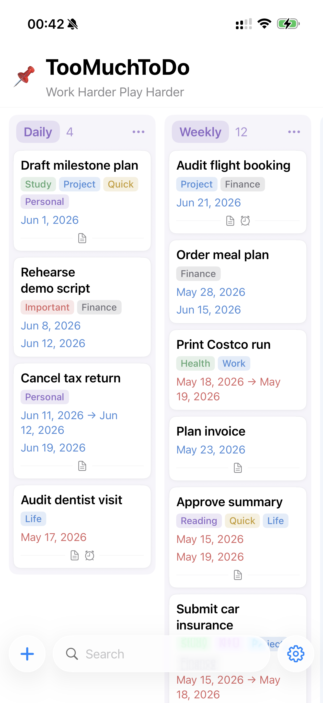
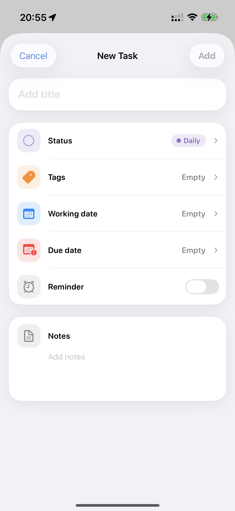
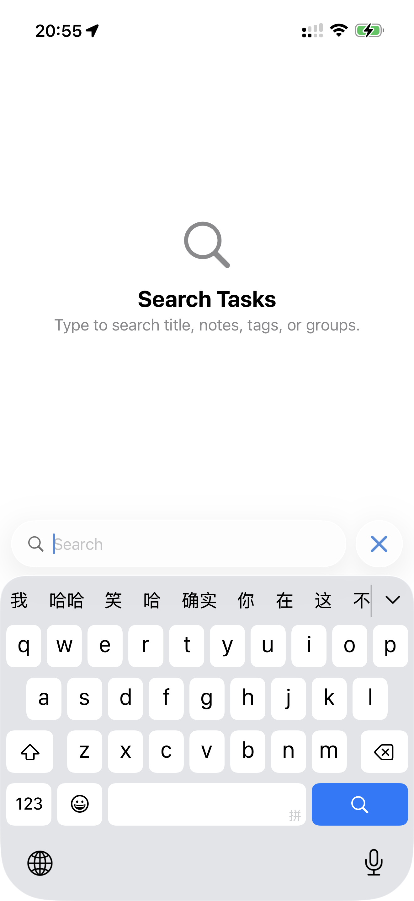

# Task

<p align="center">
  
</p>

A privacy-focused iOS task manager built with SwiftUI. Kanban-style board with customizable groups, tags, working/due dates, and per-task reminders. Local-first via SwiftData with an iCloud sync upgrade path. Includes a home-screen widget for upcoming tasks.

Current app version: **0.2.0 (build 2)**

## Screenshots

<p align="center">
  
  
  
</p>

## Requirements

- iOS 18.0+
- Xcode 16.0+ (uses synchronized folder references)
- Swift 5 language mode

## Features

- **Kanban board** — horizontally scrollable groups. Defaults seed Daily, Weekly, Waiting, Doing, Pending, Done; users can rename, recolor, reorder (drag the colored pill header), add, and delete.
- **Editable board header** — tap the title and subtitle to rename; tap the emoji icon to pick from a 40-emoji curated set.
- **Cards**
  - Title
  - **Multi-line tag chips** that wrap to additional rows when too wide — the card auto-grows
  - Working date row (single day or range) and due date row, each blue when upcoming, red once arrived or passed
  - Footer divider (`─── icon ───`) at the bottom of the card showing a notes icon when notes are non-empty and/or an alarm icon when a reminder is set; the row is omitted when neither applies
  - Per-column **Top 10 + "More +N"** pagination so a 100-card group doesn't render everything at once
- **Drag and drop** — long-press to lift a card, group header pill, or settings row, then drag to reorder. Used in three places: cards reorder within their column or move across columns to change status, group pills reorder columns, and Groups / Tags rows in Settings reorder via long-press (no separate Reorder button). Live reorder — undragged siblings slide out of the way as the lifted item passes over them. Uses `.move` operation (no green `+` badge); the lifted preview is clipped to the card / pill / row shape; the source stays in place during drag (matches iOS Reminders).
- **Pull-to-refresh** on each column resets pagination back to 10 and re-renders, in case the UI ever feels stuck.
- **Custom calendar picker** — month grid; single-tap to set, tap selected day to clear. Toggle End Date in the Working Date sheet to pick a range — the start and end fill solid; the days between form a tinted strip (slightly shorter than the endpoints).
- **Local notifications** scheduled via `UNUserNotificationCenter`. Per-task Reminder toggle; the time-of-day comes from the user-configurable **Reminder Time** in Settings (defaults to 9:00).
- **Search** — the bottom-bar search field transforms when focused (the `+` and Settings buttons slide out, an `X` cancel slides in). Inline results replace the board, filtering by title, notes, tag names, and group names live.
- **Liquid Glass bottom nav** on iOS 26+ via `GlassEffectContainer` + `.glassEffect()`. iOS 18–25 falls back to the previous `.thinMaterial` design.
- **Settings**
  - **Appearance** — Theme, Language, **Time Format** (System / 12-hour / 24-hour), Text Size, Group Width, App Accent (nine pure system colors matching iOS), App Icon. Theme / Accent / Icon / etc. pickers all open as `[.medium, .large]` detent sheets.
  - **Default**
    - **Status** — the group new tasks land in when created from the bottom-bar `+` button. Defaults to the first group; falls back automatically if the chosen group is later deleted.
    - **Card Order** — choose how cards are sorted within every group.
      - *Sort By*: **Manual** (drag to order) · **Title** (alphabetical) · **Date** (smart: working date → due date → title, with sensible nil fallbacks)
      - *Order*: **Ascending** / **Descending** (disabled when Sort By is Manual)
    - **Reminder Time** — the time-of-day that per-task reminders fire on the chosen date. Custom HH:MM keypad sheet (Coin-style): type `900` → 9:00, `2130` → 21:30; `Now`, `C`, `⌫`, `00`, AM/PM toggle (12-hour mode only). Respects the Time Format setting. Defaults to 9:00.
  - **Customization** — **Groups** (add / rename / recolor / long-press drag-reorder / delete), **Tags** (same).
  - **Data** — iCloud Sync (Coming Soon), Manual Control → Export Data, Import Data (merges by ID then by name), Reset All Data.
  - **About** — How to Use (7 numbered guide cards), Feedback (mailto with prefilled body), Privacy, Disclaimer, Copyright, Version.
- **Every popup has both Cancel and Done** in its toolbar so users can confirm or back out consistently. Save-style sheets (Group Menu, Tag Edit, New Tag) keep their explicit Save / Add labels.
- **Confirmation popups** for every destructive action (Delete Task, Delete Group, Delete Tag, Reset All Data) — `ConfirmationSheet` with a tinted icon tile, title, message, and red Confirm / gray Cancel buttons.
- **Progress overlays** during Import and Export, plus a native iOS alert ("Import Successful" / "Export Successful") on completion.
- **Widget** — Upcoming Tasks home-screen widget (small / medium / large), reads a JSON snapshot from the App Group container shared with the main app.
- **Local-first** via SwiftData; schema designed for an iCloud sync toggle later (every property defaulted, no `.unique` constraints, optional inverse relationships).
- **Localization** — English + Simplified Chinese via `Localizable.xcstrings`.

## Project Structure

```text
Task/
├── Task/                                # SwiftUI app
│   ├── Models/                          # Board, BoardGroup, TaskTag, TaskItem, ColorKey
│   ├── Views/
│   │   ├── Board/                       # BoardView, ProjectHeaderView, ColumnView, TaskCardView,
│   │   │                                #   GroupMenuSheet, BoardIconPickerSheet
│   │   ├── Task/                        # TaskDetailView, TagPickerSheet, StatusPickerSheet
│   │   ├── Search/                      # SearchView
│   │   ├── Settings/                    # SettingsView, AppearanceView (Theme / Accent / TextSize /
│   │   │                                #   ColumnWidth / Language / TimeFormat / ReminderTime sheets),
│   │   │                                #   IconPickerSheet, CardOrderPickerSheet, DefaultStatusPickerSheet,
│   │   │                                #   ManageGroupsView, ManageTagsView, ManualControlSheet, AboutSheets
│   │   └── RootView.swift
│   ├── ViewModels/                      # SettingsViewModel (theme/language/time-format/text-size/
│   │                                    #   group-width/accent/icon/card-sort/reminder-time/default-status)
│   │                                    #   + nonisolated ReminderDefaults enum used by the notif service
│   ├── Services/                        # SwiftDataManager (container + seed), NotificationService,
│   │                                    #   SharedDefaultsService, UpcomingSnapshotBuilder,
│   │                                    #   DataImportExport
│   ├── Components/                      # GroupHeaderPill, TagChip, DateRow, BottomNavBar,
│   │                                    #   ColorSwatchPicker, GridTile, SettingsCard,
│   │                                    #   CardBackground, ConfirmationSheet, ProgressOverlay,
│   │                                    #   CalendarPicker, StringMoveDropDelegate, FlowLayout
│   ├── Utils/                           # DateFormatters (date + TimeFormatting helper), AppInfo
│   ├── Assets.xcassets                  # AccentColor, AppIcon + 5 alternates, AppIconPreviews/
│   ├── Localizable.xcstrings            # en + zh-Hans
│   ├── PrivacyInfo.xcprivacy
│   ├── Task.entitlements                # App Group: group.com.ijustin.task
│   └── TaskApp.swift                    # Info.plist is generated (GENERATE_INFOPLIST_FILE = YES)
├── TaskWidgetExtension/                 # Upcoming-tasks home-screen widget
│   ├── TaskWidgetBundle.swift
│   ├── UpcomingTasksWidget.swift
│   ├── UpcomingTasksProvider.swift
│   ├── WidgetSnapshot.swift             # Mirrors the App Group JSON shape
│   ├── Assets.xcassets
│   └── Info.plist
├── TaskTests/                           # Unit tests
└── task.xcodeproj/
    ├── project.pbxproj                  # Uses Xcode 16 synchronized folder references
    └── xcshareddata/xcschemes/Task.xcscheme
```

## Build

1. Open `task.xcodeproj` in Xcode.
2. Select the `Task` scheme.
3. Build and run on an iPhone simulator or device.

On first launch the app seeds six default groups and an editable board title.

## Data Format

Export produces JSON in this shape:

```json
{
  "version": 1,
  "exportedAt": "ISO-8601",
  "board": { "id", "title", "subtitle", "iconEmoji", "createdAt", "updatedAt" },
  "groups": [{ "id", "name", "colorKey", "sortIndex", "createdAt" }],
  "tags":   [{ "id", "name", "colorKey", "sortIndex", "createdAt" }],
  "tasks":  [{
    "id", "title", "notes", "workingStart", "workingEnd", "dueDate",
    "hasReminder", "sortIndex", "createdAt", "updatedAt",
    "groupID", "tagIDs"
  }]
}
```

Import merges in this order:

1. **ID match** — same UUID → update in place.
2. **Name match** (groups and tags only, case-insensitive) — same name → update existing entity; the imported UUID is remapped to the existing record so referenced tasks/tags resolve correctly.
3. **Insert** — neither match → create a new entity with the imported UUID.

Existing entities not present in the imported file are preserved (non-destructive merge). Older exports (pre-0.2.0 — no `sortIndex` on tags) still import cleanly; missing tag `sortIndex` defaults to `0` and the existing `createdAt` tiebreaker keeps the original creation order.

## Documentation

- [LessonsLearned.md](LessonsLearned.md) — implementation notes, pitfalls, and design decisions worth remembering.
- [VersionHistory.md](VersionHistory.md) — release notes.

## Privacy

Task is local-first. Boards, groups, tags, tasks, and preferences live on-device via SwiftData. The widget reads a small JSON snapshot from the App Group container (`group.com.ijustin.task`). The app makes no network requests of its own. Notifications are scheduled locally only when a task's reminder is on. See **Settings → About → Privacy** in-app for the full breakdown.

## License

Task is source-available, not open source. The code is public for transparency and personal, non-commercial evaluation only. Commercial use, redistribution, App Store/TestFlight/enterprise distribution, derivative app publishing, sublicensing, and reuse of Task branding/assets are prohibited without prior written permission.

See [LICENSE](LICENSE) for the full Task Source-Available License. Third-party notices are in [THIRD_PARTY_NOTICES.md](THIRD_PARTY_NOTICES.md).
