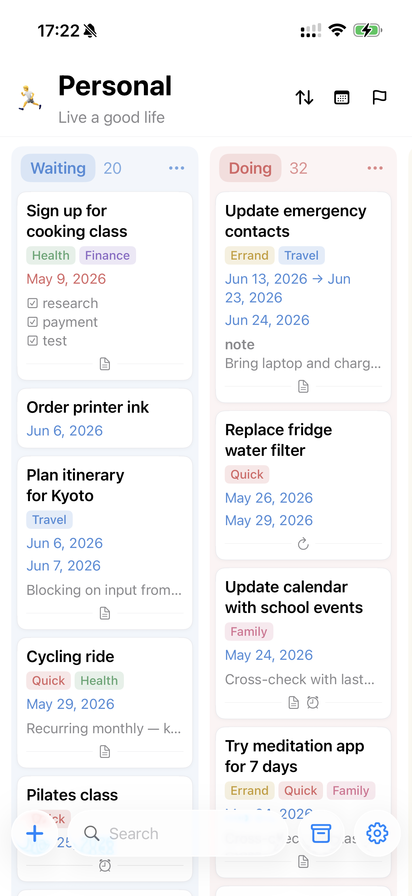
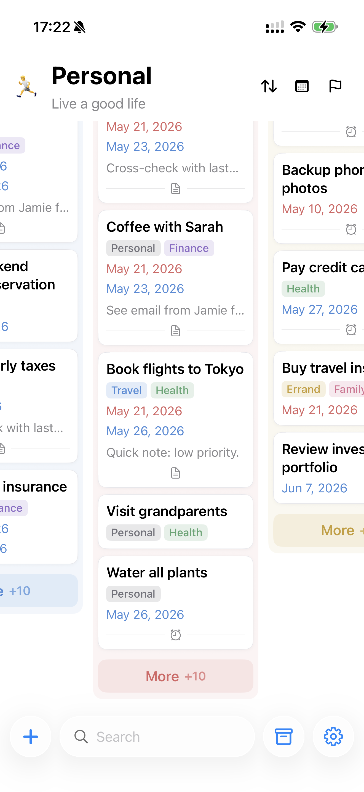
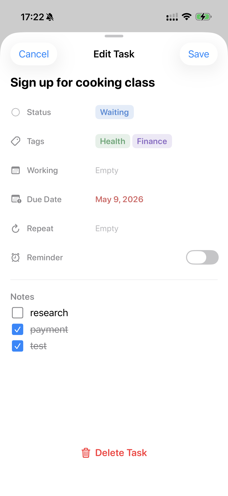
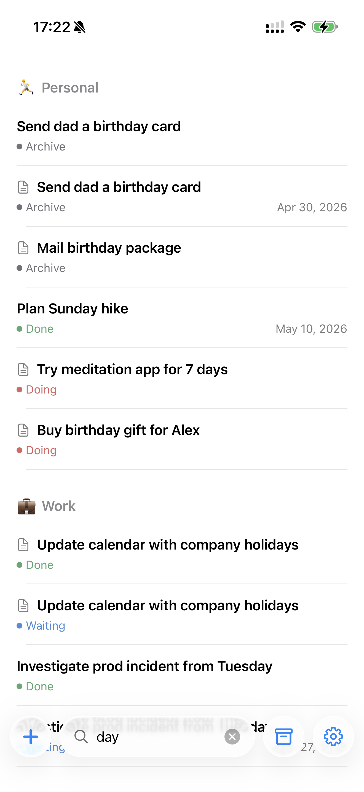
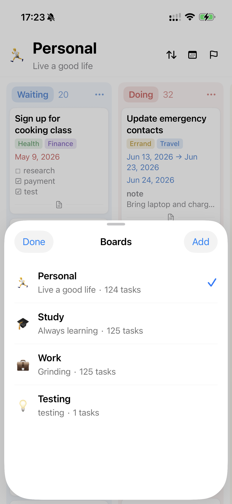
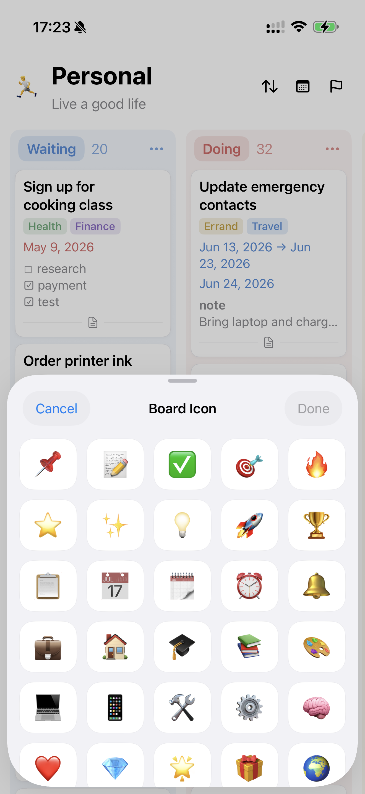

# Task

  

A privacy-focused iOS task manager with a Notion-style task editor and a Kanban board home. Multiple boards, multi-select tags, working dates and due dates, local notifications, and a home-screen widget — all on-device.

Current app version: **0.4.7 (build 6)**

## Screenshots

  
  
  

  
  
  

## Highlights

- **Multiple boards.** Fresh installs ship with Personal 🏃, Study 🎓, and Work 💼 — each with its own groups, tags, tasks, and defaults. Switch from the archive button in the bottom bar; long-press a tile in the switcher to reorder, or drag onto the trash zone to delete.
- **Kanban home.** Horizontally scrolling columns under your board's title. Cards show tags, working dates, due dates, notes, and reminders at a glance. Long-press to drag cards between columns or reorder within a column.
- **Notion-style task editor.** A clean property list — Status, Tags, Working, Due Date, Reminder — plus a notes block that supports Markdown and interactive checklists.
- **Working dates and due dates.** A custom calendar picker with single-day or range selection. Dates show blue when upcoming and red once today or past.
- **Local reminders.** Per-task toggle. Time-of-day is configurable per board (Settings → Board → Reminder Time, default 9:00).
- **Search.** Tap the search field to find tasks by title, notes, tag, or group across every board — results are grouped by board with the active one on top.
- **Customization.** Per-board groups (rename, recolor, reorder, add, delete) and tags. App-wide theme, accent, language, time format, text size, column width, and a choice of six app icons.
- **Home-screen widget.** "Upcoming Tasks" in small / medium / large. Long-press → Edit Widget to pin it to a single board or show all of them.
- **Multi-board export / import.** A single JSON file holds every board, group, tag, and task. Imports merge non-destructively. Reset All Data wipes everything and re-seeds the three defaults.
- **Local-first and private.** All data lives on-device via SwiftData. No accounts, no network calls. iCloud sync is on the roadmap.

## Requirements

- iOS 18.0+
- Xcode 16.0+

## Build

1. Open `task.xcodeproj` in Xcode.
2. Select the `Task` scheme.
3. Build and run on an iPhone simulator or device.

The signing team ID lives in [`Config/Signing.xcconfig`](Config/Signing.xcconfig). Contributors can override it without touching the project file by creating `Config/Signing.local.xcconfig` (gitignored) containing `DEVELOPMENT_TEAM = YOUR_TEAM_ID`.

On first launch the app seeds the three default boards. Edit the title, subtitle, and emoji of any board by tapping them directly.

## Data Format

Export emits a multi-board JSON payload (`version: 2`) containing every board, its groups, its tags, and its tasks. The decoder also accepts the legacy single-board format from earlier versions so old backups round-trip cleanly. Import merges non-destructively — existing entities not present in the file are preserved. Full schema is in [LessonsLearned.md](LessonsLearned.md).

## Documentation

- [LessonsLearned.md](LessonsLearned.md) — implementation notes, pitfalls, and design decisions worth remembering.
- [VersionHistory.md](VersionHistory.md) — release notes.

## Privacy

Task is local-first. Boards, groups, tags, tasks, and preferences live on-device via SwiftData. The widget reads a small JSON snapshot from the App Group container (`group.com.ijustin.task`). The app makes no network requests of its own. Notifications are scheduled locally only when a task's reminder is on. See **Settings → About → Privacy** in-app for the full breakdown.

## License

Task is source-available, not open source. The code is public for transparency and personal, non-commercial evaluation only. Commercial use, redistribution, App Store/TestFlight/enterprise distribution, derivative app publishing, sublicensing, and reuse of Task branding/assets are prohibited without prior written permission.

See [LICENSE](LICENSE) for the full Task Source-Available License. Third-party notices are in [THIRD_PARTY_NOTICES.md](THIRD_PARTY_NOTICES.md).
